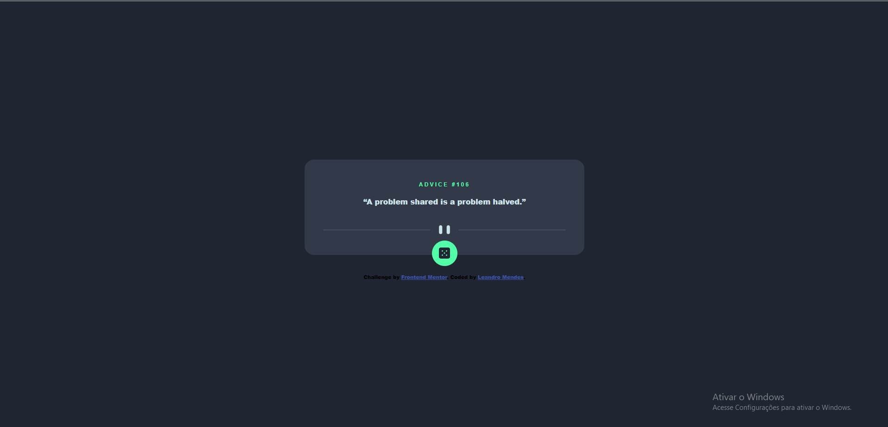

# Frontend Mentor - Advice generator app solution

This is a solution to the [Advice generator app challenge on Frontend Mentor](https://www.frontendmentor.io/challenges/advice-generator-app-QdUG-13db). Frontend Mentor challenges help you improve your coding skills by building realistic projects.

## Table of contents

- [Overview](#overview)
  - [The challenge](#the-challenge)
  - [Screenshot](#screenshot)
  - [Links](#links)
  - [Built with](#built-with)
  - [What I learned](#what-i-learned)
  - [Continued development](#continued-development)
  - [Useful resources](#useful-resources)
- [Author](#author)

## Overview

### The challenge

Users should be able to:

- View the optimal layout for the app depending on their device's screen size
- See hover states for all interactive elements on the page
- Generate a new piece of advice by clicking the dice icon

### Screenshot

### Links

- Solution URL:(https://www.frontendmentor.io/challenges/advice-generator-app-QdUG-13db/hub)
- Live Site URL: [Add live site URL here](https://app.netlify.com/sites/heartfelt-cannoli-971362/deploys/64a753b70579060812adec31)
 

### Built with

- Semantic HTML5 markup
- CSS custom properties
- Flexbox
- [React](https://reactjs.org/) - JS library
- [Next.js](https://nextjs.org/) - React framework

**Note: These are just examples. Delete this note and replace the list above with your own choices**

### What I learned

Learned how use a external api using JS.

### Continued development

I intend of continue improving my skills with react and this parts of how to use hooks.

### Useful resources

- [Example resource](https://www.youtube.com/watch?v=GGo3MVBFr1A&list=LL&index=2&t=62s) - This helped as a example of how use a hook right.

## Author

- Frontend Mentor - [leandro mendes](https://www.frontendmentor.io/profile/leandromendes25)
